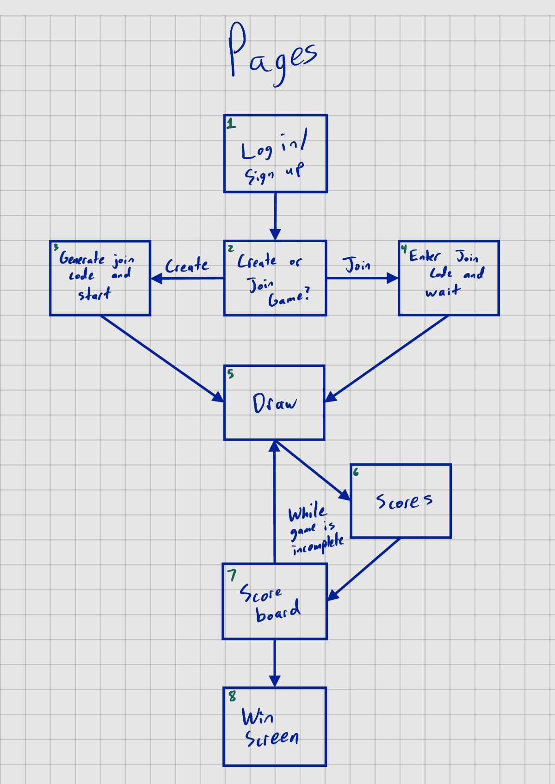
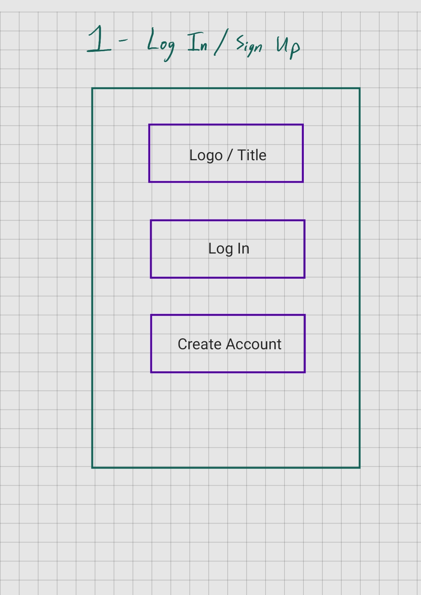
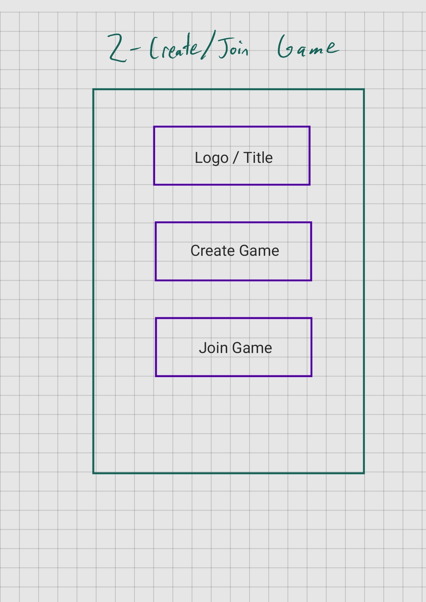
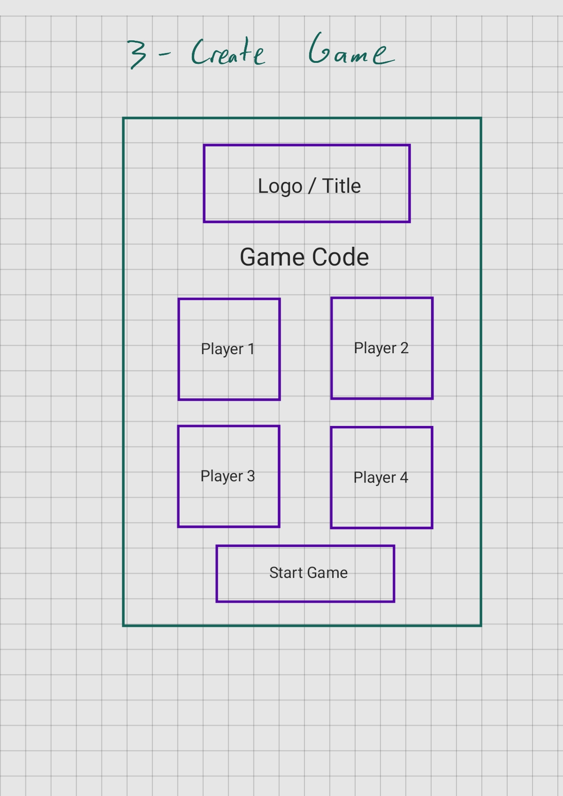
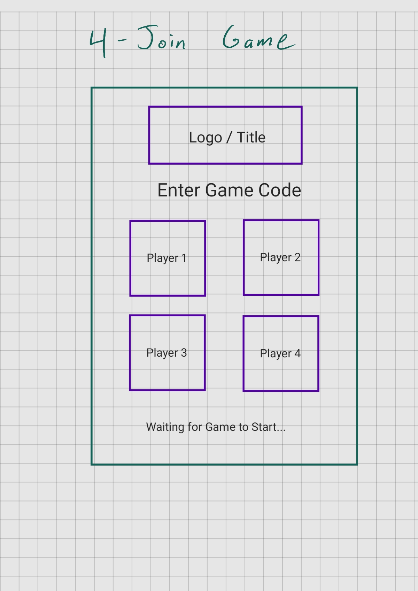
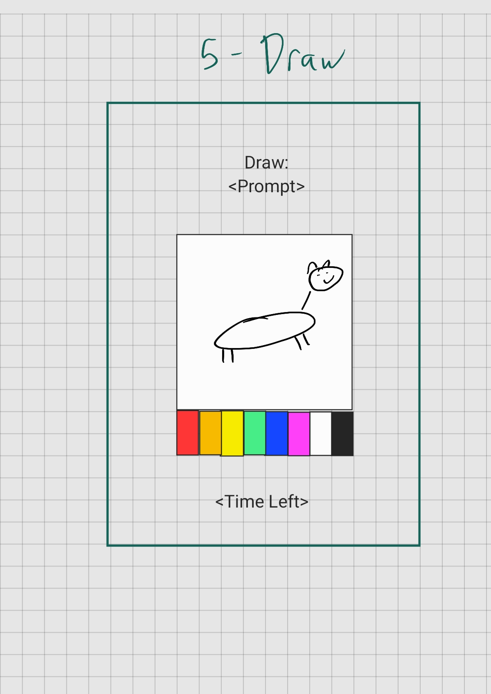
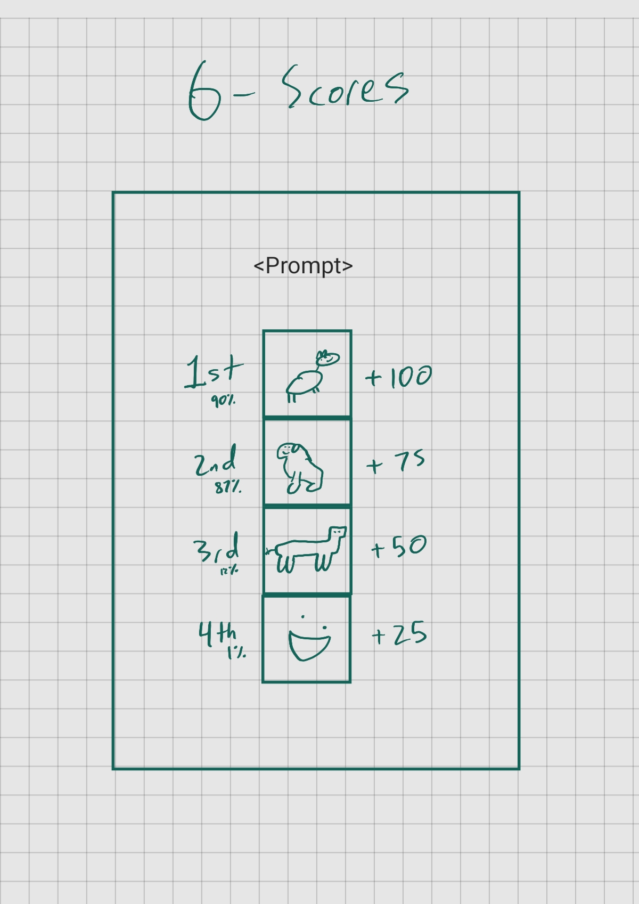
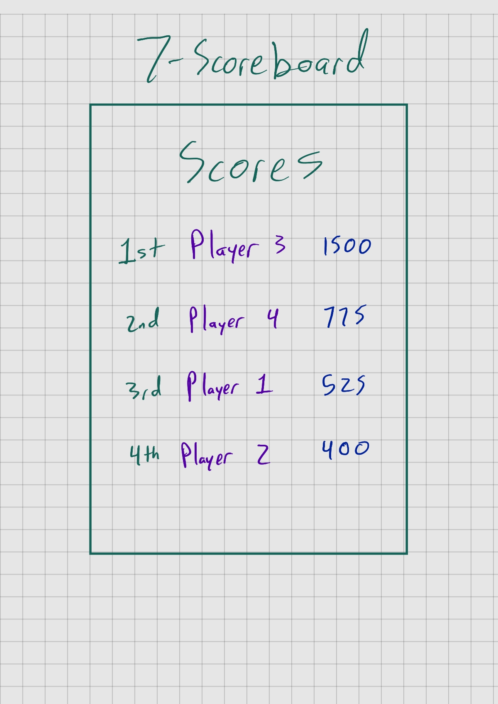
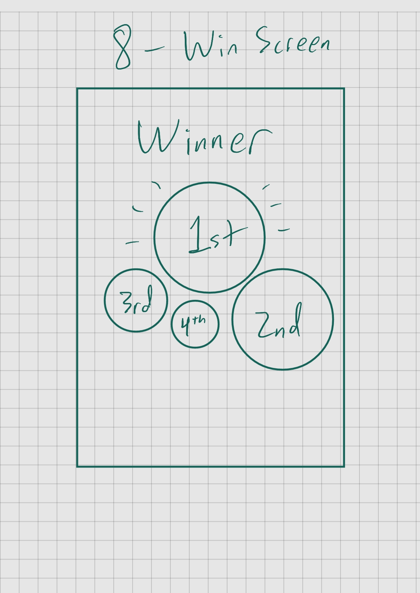
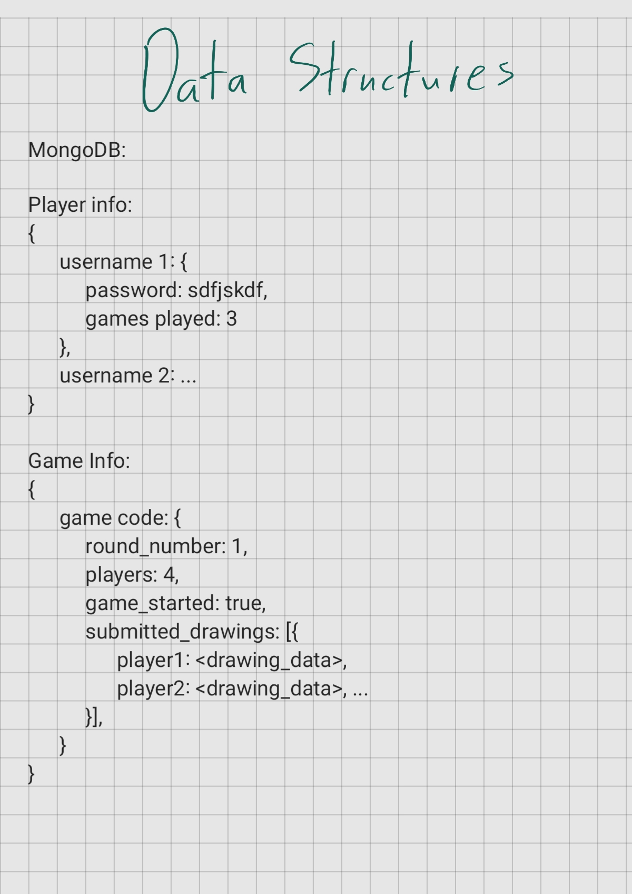

# startup
## Github Assignment
CS 260 Start Up Project
This is where I'll keep notes.
I have successfully uploaded this to replit and it looks like version control works here too. How cool! It syncs with my github repository just fine.
I am already really familiar with github. I am a web developer for the BYU Law school and we use it for all our major projects. As for what I learned in the github assignment for this course, it really was just realizing that I can connect an online IDE to github.

**[Startup Repository](https://github.com/pf274/startup.git)**

## Elevator Pitch
Have you ever wanted to pit your drawing abilities against your friends and have an impartial judge? With Draw AI, you can do just that! Draw AI allows you to enter into a fun, fast-paced drawing challenge judged by Artificial Intelligence. To play the game, the website first gives you and your friends the same prompt. Each person playing then draws the prompt to the best of their ability under the time constraint, then the AI looks at each drawing and gives each one a score based on how recognizable it is. These scores are converted to points in the game, and the game continues on until several rounds have passed. This game is quick and quirky, and will leave you and your friends laughing.

### Concept Art

### Key Features:
* Secure sign up / log in
* Multiplayer support
* AI picture recognition
* Real-time updates
* Player data stored in a database
* Game lobby creation
* Game synchronization
* Responsive drawing board
* Touch / Stylus support